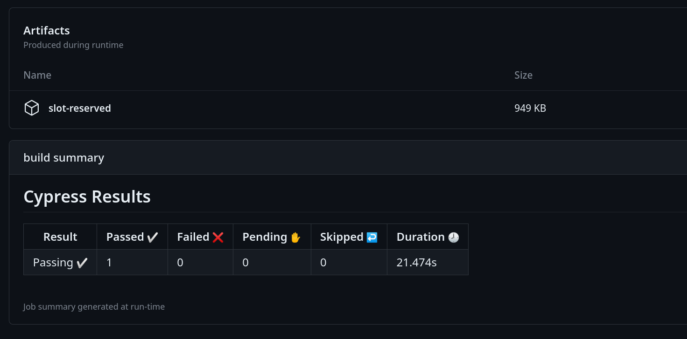

# elements-slot-scheduled-reservation

## Simple Script that reserves the elements gym reservation slot

### How To Use
1. Clone this repo
1. Create two repository secrets by going to Settings > Secrets and variables > Actions > Click on new Repository secret
    1. Or See https://docs.github.com/en/actions/security-guides/encrypted-secrets#creating-encrypted-secrets-for-a-repository
    1. Or For this repo the link is : https://github.com/comdotlinux/elements-slot-scheduled-reservation/settings/secrets/actions
1. Create a secret named `ELEMENTS_EMAIL` with value as your email
1. Create a secret named `ELEMENTS_PASSWORD` with value as your time slot reservation password
1. Goto Actions > Reserve Slot > Artifacts > slot-reserved
    1. It should look something like this  
1. Download the file and unzip it, you should have a screenshot of your reservation
1. You are Done!

* Above steps are only required once.
* There should now be a schedule that runs every day at the given time.
* If You want to change the days you want to reserve, just edit the file `.github` > `workflows` > `reserve-slot.yaml` and find the text `cron`
    * The format is a cron expression that GitHub understands. See [here](https://docs.github.com/en/actions/using-workflows/events-that-trigger-workflows#schedule) for details
    * Change it as you please but keep in mind this reserves for the next day so run it at most once every day and also before 1800 Hrs (this is when the window closes)
    * Commit the file and your schedule will run accordingly.
 
Editted on 19.09.23
